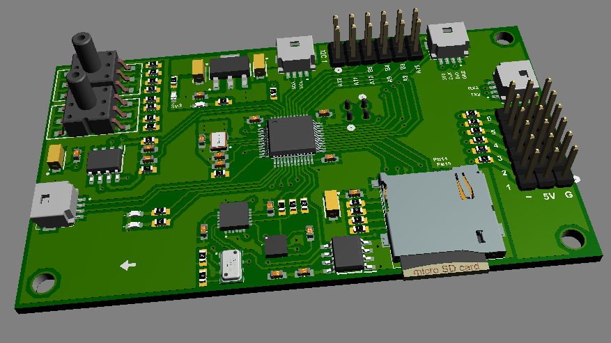
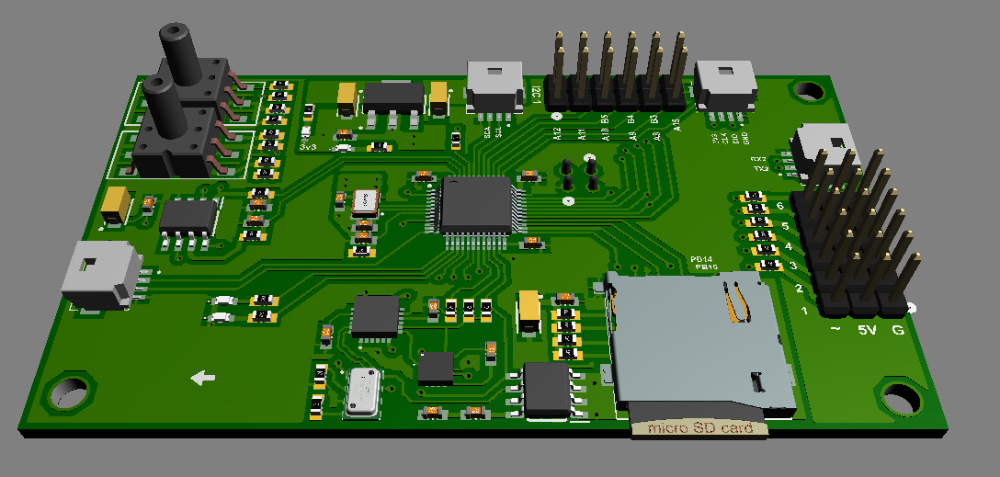
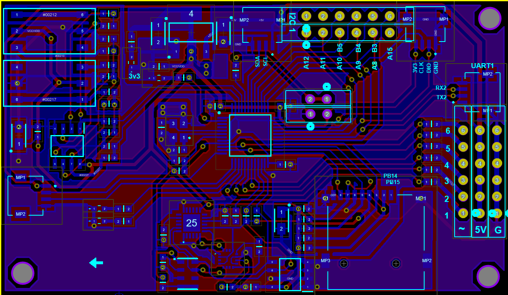
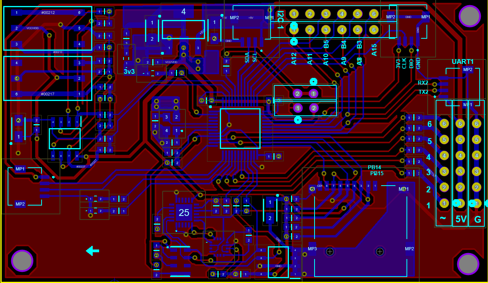
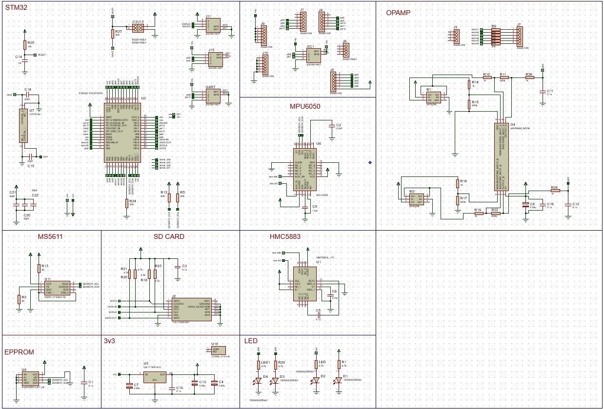

#ARM-Pilot

###HALDWAVE
PCB design with proteus
- 5v operation
- 2 UART
- 1 I2C
- 6 PWM output
- 9 GPIO pin
- MCU stm32f103c8t6
- MPU-6050 imu
- HMC-8553 magnetic sensor
- MS-5611  baro
- 2x ms40xx pressure sensor for Pitot
- SD card 
- 24HCxx Epprom ic

|                |                |
| ---------------------- | ---------------------- |
|  | |

Schematic

 

